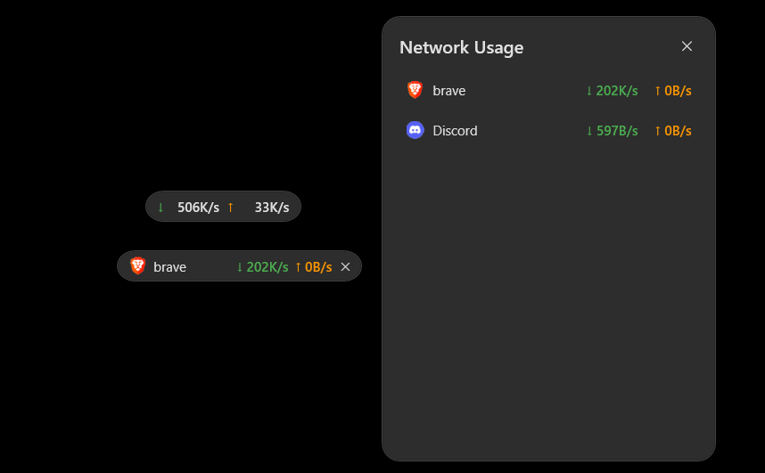
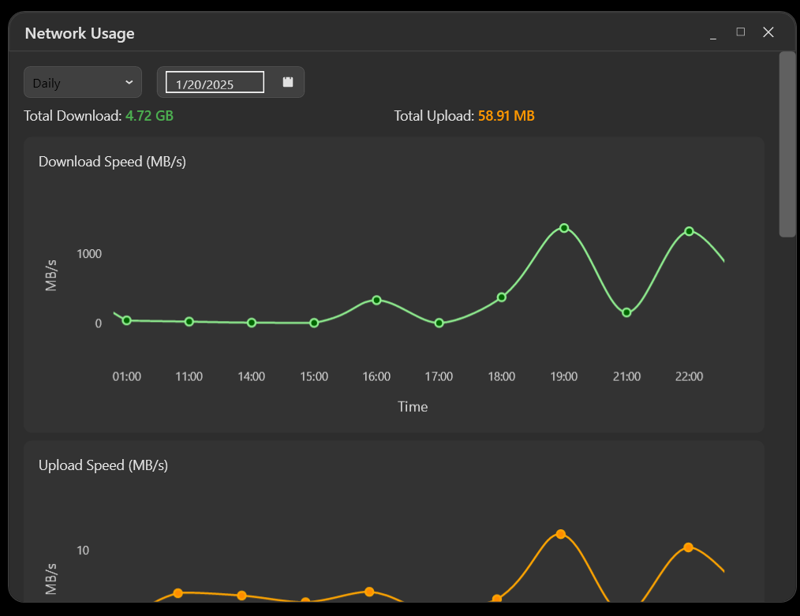
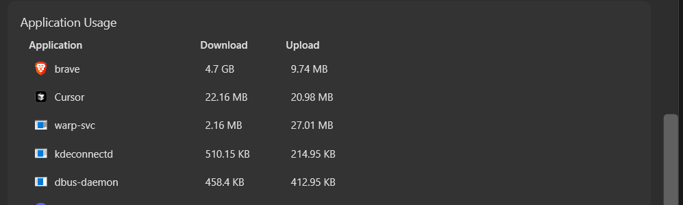

# NetSpeedWidget

A lightweight, modern network monitoring widget for Windows that displays real-time network speeds and per-application network usage.

> Note: This project was developed using Cursor IDE.






## Features

- Minimal, modern UI design with a dark theme
- Real-time network speed monitoring (download and upload)
- System tray integration with speed tooltip
- Per-application network usage monitoring
- Detailed view for individual application network usage
- Network usage statistics with charts (daily, weekly, monthly, yearly)
- Multi-language support (English, Turkish, German, Spanish, French, Italian, Japanese, Korean, Chinese)
- Draggable windows for flexible positioning
- Always-on-top display option
- Double-click to show/hide windows

## Requirements

- Windows 10 or later
- .NET 6.0 Runtime
- Administrator privileges (required for network monitoring)

## Installation

1. Download the latest release from the [Releases](https://github.com/mucahit-sahin/NetSpeedWidget/releases) page
2. Extract the zip file to your preferred location
3. Run `NetSpeedWidget.exe` as administrator

## Usage

### Main Widget

- **Drag**: Click and drag to move the widget
- **Double-click**: Opens the Network Usage window
- **Triple-click**: Opens the Network Stats window
- **System Tray**:
  - Double-click the tray icon to show the widget
  - Right-click for menu options (Show/Network Stats/Exit)

### Network Usage Window

- Shows all applications using the network
- Displays per-application download and upload speeds
- Double-click any application to open a dedicated monitoring widget
- Click and drag to move the window
- Click the X button to close

### Network Stats Window

- Shows network usage statistics with interactive charts
- Supports different time periods (daily, weekly, monthly, yearly)
- Displays total download and upload amounts
- Shows per-application network usage statistics
- Sortable application list
- Resizable window with minimize/maximize options

### Application Details Widget

- Shows real-time network speeds for a specific application
- Click and drag to move the widget
- Double-click or click X to close
- Always stays on top for easy monitoring

### Settings

- Language selection (9 languages supported)
- Start with Windows option
- Changes take effect after restart

## Building from Source

1. Clone the repository:

```bash
git clone https://github.com/mucahit-sahin/NetSpeedWidget.git
```

2. Open the solution in Visual Studio 2022 or use the .NET CLI:

```bash
cd NetSpeedWidget
dotnet build
```

3. Run the application:

```bash
dotnet run
```

## Technologies Used

- C# / .NET 6.0
- WPF (Windows Presentation Foundation)
- MVVM Architecture (CommunityToolkit.Mvvm)
- Entity Framework Core with SQLite
- LiveCharts2 for data visualization
- Windows Performance Counters
- ETW (Event Tracing for Windows)

## Contributing

Contributions are welcome! Please feel free to submit a Pull Request.

## License

This project is licensed under the MIT License - see the [LICENSE](LICENSE) file for details.

## Acknowledgments

- Built with [CommunityToolkit.Mvvm](https://github.com/CommunityToolkit/dotnet)
- Charts powered by [LiveCharts2](https://github.com/beto-rodriguez/LiveCharts2)
- Database management with [Entity Framework Core](https://github.com/dotnet/efcore)
